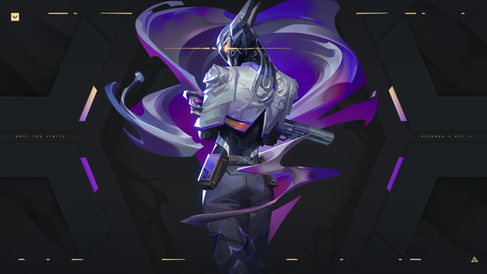

<h1 align="center">Hola, soy <a href="#">Royalty</a> 👋😁</h1>

## Sobre mi

- 💡 Diseñadora Multimedial
- 💰 Conocimiento en Diseño web, Blender (contenido 3D) y Brand de Marcas
- 🎮 Gamer 

## ⚙️ &nbsp;GitHub Analytics

